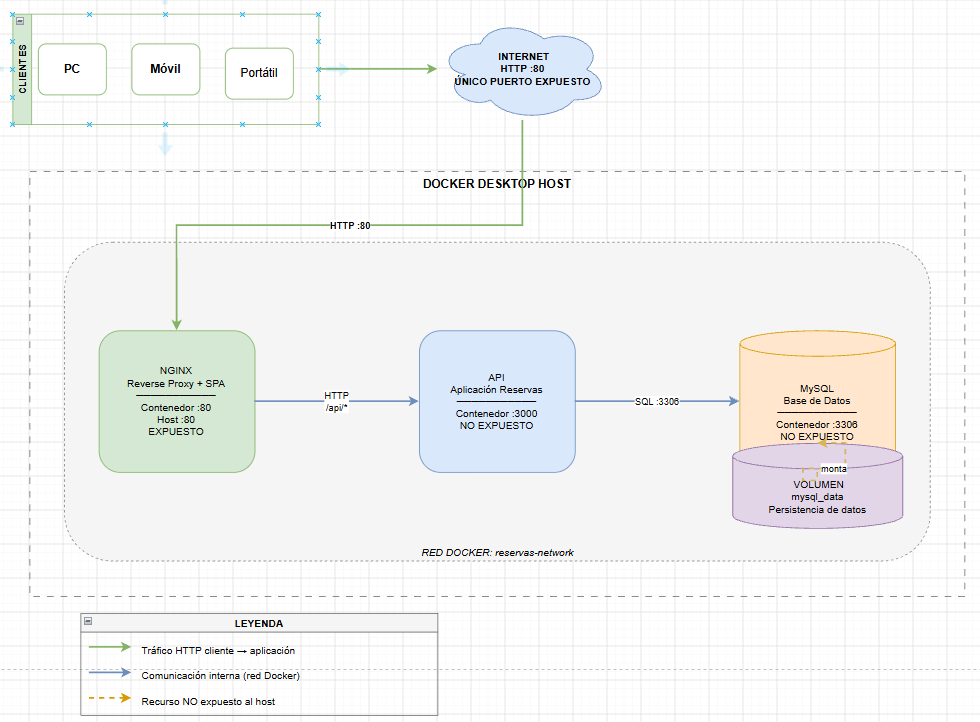

# Plataforma de Reservas — Actividades Culturales de Sevilla
Documentación de despliegue para una plataforma de reservas de talleres, visitas
y eventos culturales en Sevilla.

| Actividad | DAW · UD01 · AEE RA1 |
|---|---|
| Autor | Manuel Parrilla Lahoz |
| Rol | Equipo de despliegue |
| Estado documentado | 2026-10-01 |

---

## Índice

1. [Estado del proyecto](#1-estado-del-proyecto)
2. [Inventario del repositorio](#2-inventario-del-repositorio)
3. [Arquitectura propuesta](#3-arquitectura-propuesta)
4. [Evidencias y limitaciones](#4-evidencias-y-limitaciones)
5. [Requisitos para completar el despliegue](#5-requisitos-para-completar-el-despliegue)

---

## 1. Estado del proyecto

El escenario de la actividad indica que el equipo de desarrollo entrega una API,
una interfaz web y un esquema de base de datos. Sin embargo, esos componentes **no
estaban incluidos entre los archivos recibidos**. En consecuencia, todavía no es
posible desplegar ni probar la aplicación de ese equipo.

El diagrama de este documento representa una **arquitectura propuesta**, no una
solución ya implementada. No se afirma que la API, el frontend o la base de datos
estén disponibles o en funcionamiento.

## 2. Inventario del repositorio

| Elemento | Estado |
|---|---|
| `README.md` | Documentación del proyecto |
| `compose.yaml` | Existe, pero está vacío |
| `docs/image.png` | Diagrama de arquitectura propuesta |
| `.env.example` | Plantilla provisional de variables MySQL; no contiene credenciales reales |
| `.gitignore` | Excluye `.env` y otros archivos locales de entorno |
| `.dockerignore` | Excluye Git, archivos de entorno y dependencias locales del contexto Docker |
| API, frontend, Dockerfiles, configuración de Nginx, esquema SQL y pruebas | No están presentes |

La estructura disponible actualmente es:

```text
proyecto-reservas/
├── docs/
│   └── image.png
├── .dockerignore
├── .env.example
├── .gitignore
├── compose.yaml
└── README.md
```

## 3. Arquitectura propuesta



El diseño previsto consta de tres capas: Nginx sería el único punto de entrada
HTTP; la API se ejecutaría en un contenedor independiente; y MySQL almacenaría los
datos en un volumen nombrado. Los servicios se comunicarían mediante una red de
Docker.

## 4. Evidencias y limitaciones

| Evidencia solicitada | Estado | Motivo o siguiente acción |
|---|---|---|
| Diagrama de arquitectura | Disponible como propuesta | Revisarlo si cambian las decisiones técnicas |
| Repositorio Git con todos los componentes | Parcial | Faltan API, frontend, esquema SQL, Dockerfiles y configuración |
| Validación con `docker compose config` | Pendiente | Actualmente devuelve `empty compose file`: `compose.yaml` está vacío |
| Dockerfile seguro para la API | Pendiente | Se necesita el código y conocer su entorno de ejecución |
| Estado de servicios y logs | Pendiente | No hay servicios definidos que puedan arrancarse |
| Pruebas HTTP de la aplicación | Pendiente | No hay una aplicación HTTP disponible para probar |
| Prueba integrada de persistencia | Pendiente | No hay una base de datos configurada ni un esquema SQL |
| README técnico de ejecución | Parcial | Las instrucciones se completarán cuando exista una solución ejecutable |
| Defensa del diseño | Parcial | Se pueden justificar las decisiones propuestas, no presentar resultados de ejecución |

Las capturas del diagrama no deben presentarse como prueba de que los contenedores
funcionan. Cuando estén disponibles los componentes, las evidencias deberán mostrar
los comandos ejecutados y sus resultados: validación de Compose, servicios activos,
logs, respuesta HTTP y recuperación de los datos tras recrear el contenedor,
conservando el volumen.

## 5. Requisitos para completar el despliegue

Cuando se reciban los componentes, el equipo deberá disponer de Docker Desktop con
Compose v2, Git y un cliente HTTP, como `curl`.

El objetivo de arranque es:

```powershell
docker compose up --build
```

Este comando es un requisito de la entrega, **no está validado en el estado actual**.


